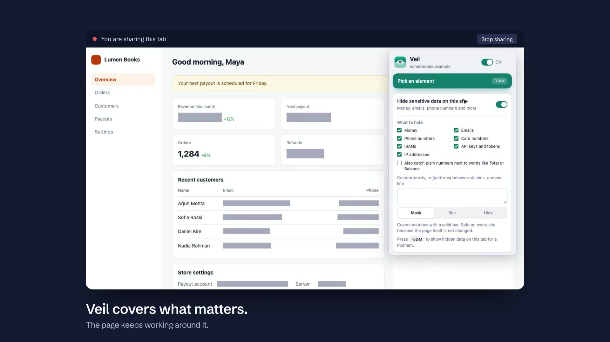

# Veil: Hide, Blur & Rewrite

Website: <https://vail.jnahian.me/>

Demo: <https://youtu.be/-tR-An6twFQ>

[](https://vail.jnahian.me/#demo)

Twenty seconds of Veil covering a billing page, with sound: <https://vail.jnahian.me/#demo>

A Chrome extension for picking any element on a web page and then hiding it, blurring it, or replacing its text. It can also hide money, emails, phone numbers and other sensitive data across a whole site. Your changes are saved and come back every time you visit.

## Install

The demo video says that Veil is free on the Chrome Web Store. The listing is still in review, so it has no public page yet. Until it is live, install Veil from the release zip:

1. Download `veil-<version>.zip` from the [latest release](https://github.com/jnahian/vail/releases/latest).
2. Unzip it into a folder that you keep, for example `veil`. Chrome loads Veil from this folder, so do not delete or move it.
3. Open `chrome://extensions` and turn on **Developer mode** (top right).
4. Click **Load unpacked**, then select the folder that contains `manifest.json`.
5. Pin Veil from the puzzle-piece menu.

To update Veil, unzip the new release into the same folder, replacing the old files. Then click the reload icon on the Veil card at `chrome://extensions`.

When Veil is installed, updated or reloaded, it starts again in the tabs that are already open. If a tab does not respond, reload it.

## Use

There are three ways to start:

- Click the toolbar icon, then **Pick an element**.
- Press **Alt+Shift+V**.
- Right-click anything on the page and choose **Veil this element**. This skips the picker.

While picking:

| Key | Action |
|---|---|
| Click or Enter | Select the highlighted element |
| ↑ / ↓ | Move to the parent or child element |
| Esc or right-click | Cancel |

After you select an element, a panel appears.

- **This page / Whole site** sets where the change applies. Veil remembers your last choice.
- **Replace text** makes the element editable in place, so it keeps the site's font, size and color. Press Enter to save, Shift+Enter for a new line, and Esc to cancel.
- **Blur** shows a live preview. You can adjust the strength, and optionally have the element show clearly while you hover over it.
- **Hide** offers two modes. "Keep the space" leaves a blank gap. "Remove from the layout" lets the page close up around it.
- **Select parent / Select child** adjusts your selection without restarting the picker.

Every save shows an **Undo** button for 5 seconds.

To change a saved rule, select the same element again and apply the same action. Veil updates the existing rule instead of adding a duplicate.

## Hide sensitive data on a site

In the popup, turn on **Hide sensitive data on this site**, then select the types of data to hide. Veil finds every match on the site's pages, including matches that load later, and covers them. The configuration applies per site, and each selected type shows as a row under **Sensitive data** in the popup. Delete a row to stop hiding that type.

**Types:**

| Type | Examples | How Veil avoids false matches |
|---|---|---|
| Money | `$1,240.50`, `Rs. 1,00,000` | See the list below |
| Emails | `jane@example.com` | Needs a name, an `@` and a domain |
| Phone numbers | `+880 1712-345678`, `(555) 123-4567`, `01712345678` | 9 to 15 digits. A number without separators must start with 0. Dates and `1 234 567` style amounts are skipped |
| Card numbers | `4242 4242 4242 4242` | 13 to 19 digits that pass the Luhn checksum (the check digit that all card numbers have) |
| IBANs | `DE89 3704 0044 0532 0130 00` | Must pass the IBAN checksum |
| API keys and tokens | `sk_live_…`, `ghp_…`, `shpat_…`, `AKIA…`, `xoxb-…`, JWTs | Only known key formats |
| IP addresses | `192.168.1.10` | IPv4 only |

**Custom** takes one entry per line. A plain entry matches that text, and case does not matter. An entry between slashes, such as `/INV-\d+/`, is a regular expression.

Money is the only type selected by default. Veil does not detect names, street addresses or bank account numbers, because they have no reliable format. Use the element picker for them.

**What counts as money:**
- A currency symbol or code before or after a number: `$1,240.50`, `1.240,50 €`, `৳ 5,000`, `Tk 500`, `Rs. 2,500`, `USD 99`, `99 BDT`, `CHF 1'250.00`, `US$1,000`, `50¢`.
- Short forms: `$1.2k`, `€3M`, `₹3 lakh`.
- Amounts split across elements, such as `<span>$</span><span>1,240</span>`.
- Input fields whose value has a currency, or whose label, name or placeholder says price, amount, total and similar.
- **Optional:** plain numbers next to words like Total, Balance, Price, Revenue or Fee, including `Balance | 5,000` table cells. This is off by default because it catches more false positives.

Veil skips version numbers, years, percentages and phone numbers. It also skips code elements (`code`, `pre`, `kbd` and `samp`) for every type except API keys and tokens, because pages often show keys in code elements.

**Styles:**

| Style | Looks like | Changes the page? |
|---|---|---|
| Mask (default) | Solid grey bar over the match | No. Uses Chrome's CSS Highlight API, so it's safe on React and Vue sites |
| Hide | Match is invisible, space kept | No |
| Blur | Blurred | Yes. Each match is wrapped in a `<veil-money>` tag, which can occasionally upset framework-rendered pages |

**Controls:**
- **Alt+Shift+M** shows the hidden data on the current tab. Press it again to hide it.
- The Blur style can also clear on hover. That is off by default. Turn on **Show hidden data clearly while I hover over it** under the style buttons.
- If Veil covers something that is not sensitive, pick it (or right-click it and choose **Veil this element**), then click **Keep this visible when hiding sensitive data**. The popup shows how many elements are kept visible and lets you reset them.

**Won't be caught:**
- Data drawn inside `<canvas>` (many chart libraries) or in images.
- Data inside other sites' shadow DOM components.
- Text styled with gradient fills, which the mask can't cover.
- Numbers with no currency, when the plain-number setting is off.
- Data already on screen before the first scan. The scan starts early, but a brief flash is possible on slow pages.
- Hover reveal works with the Blur style only, and only when you turn it on. With Mask and Hide, use the shortcut instead.

## Popup

The popup lists the site's rules in three groups: this page, the whole site, and other pages on the site. For each rule you can:

- Turn it on or off.
- Jump to the element on the page.
- Delete it.

The switch in the header pauses everything. **Alt+Shift+X** does the same thing.

**Export** and **Import** back up all rules as JSON. Importing merges with your existing rules and never overwrites them.

You can change shortcuts at `chrome://extensions/shortcuts`.

## How it works

- Rules are stored in `chrome.storage.local`, grouped by hostname. Page-scoped rules match on origin + path and ignore the query string and hash.
- Blur and hide are CSS injected at `document_start`, which avoids a flash of the original content in most cases.
- Text replacement runs in JavaScript. A MutationObserver re-applies it when the page re-renders (React, Vue and similar frameworks), and it also handles in-app navigation on single-page sites.
- Selectors prefer, in order:
  1. A stable `id`
  2. `data-testid` / `aria-label`-style attributes
  3. A short structural path
- Class names that look auto-generated (CSS-in-JS hashes, CSS module suffixes) are skipped. Each rule also stores the start of the element's original text as a fallback, used when the selector stops matching.

## Known limits

- **Rules can break when a site changes.** A redesign can make a selector stop matching. The text fallback recovers many of these cases, but not elements without text, such as images.
- **Lists that reorder can misfire.** A selector like "the 2nd card" may land on a different item when the list order changes.
- **Replaced text is visual only.** The original can still reach the site's own scripts, and it can reappear briefly before Veil re-applies. Don't rely on Veil to protect sensitive data during a screen share.
- **Replacing text on framework-rendered elements can occasionally break that part of the page**, because the framework expects the nodes it created. If this happens, delete the rule, or choose a smaller element that contains only text.
- **Iframes are not supported.** Veil works on the top-level page only.
- **Some pages are off limits.** Chrome blocks extensions on `chrome://` pages and the Web Store.
- **Permissions are broad.** Veil needs access to all http(s) sites so it can re-apply rules automatically. It makes no network requests, and all data stays on your machine.

## Files

```
extension/        the extension, loaded unpacked and zipped for the store
  manifest.json   MV3 manifest, permissions, shortcuts
  background.js   context menu, shortcuts, toolbar badge
  detect.js       sensitive data detection (pure text matching)
  content.js      picker, panel, editor, rule engine, sensitive data hiding
  popup.html/css/js  rule manager
  icons/          16, 32, 48, 128 px
tests/unit/     detection tests (node:test)
tests/e2e/      extension tests in Chromium (Playwright)
site/           landing page (Astro and Tailwind CSS)
```

To run the tests, use `npm install`, then `npx playwright install chromium`, then `npm test`.

## Privacy

Veil sends no data anywhere. Read the [privacy policy](PRIVACY.md).

## Publishing

The [Chrome Web Store guide](store/GUIDE.md) describes how to package and submit Veil.

## Contributing

Read the [contributing guide](CONTRIBUTING.md) and the [code of conduct](CODE_OF_CONDUCT.md). To report a security problem, follow the [security policy](SECURITY.md).

## License

Veil is released under the [MIT License](LICENSE).
